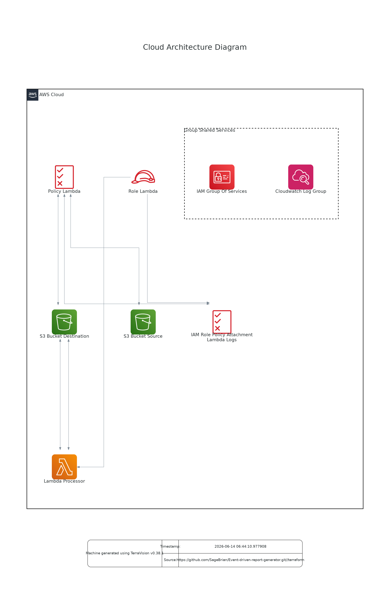

# Automated Event-Driven Report Generator (AWS-XS)

An enterprise-ready, serverless ingestion pipeline built on AWS using **Terraform (Infrastructure as Code)**. This system automatically processes raw business data uploads (`.csv`) in real-time, generates analytical summaries, and stores them securely in an optimized downstream storage tier.

## 📊 Architecture Overview





```
[Raw CSV Upload] ➡️ (S3 Source Bucket) 
                         │
                  (Event Notification)
                         ▼
                   [AWS Lambda] (Python 3.11)
                         │
                  (Processes Data)
                         ▼
             (S3 Destination Bucket) ➡️ [Amazon SES]*

```

### **Architectural Highlights & Real-World Decisions**

* **100% Serverless & Idle-Cost Free:** Utilizing AWS Lambda and Amazon S3 means the infrastructure scales automatically with traffic spikes, but costs **$0.00/month** when no files are being processed.
* **Security First (Principle of Least Privilege):** The Lambda execution role is strictly constrained using explicit IAM policies. It *only* has read access to the source bucket, write access to the destination bucket, and stream write permissions to CloudWatch Logs.
* **Resilient File Scoping:** S3 Bucket Notifications are explicitly filtered to execute only on `.csv` extensions, avoiding unintended compute costs from invalid uploads.

---

## 🛠️ Technology Stack

* **Infrastructure as Code:** Terraform (`>= 1.0.0`)
* **Cloud Provider:** Amazon Web Services (AWS)
* **Compute:** AWS Lambda (Runtime: Python 3.11)
* **Storage:** Amazon S3 (Simple Storage Service)
* **Monitoring:** AWS CloudWatch Logs

---

## 🚀 Deployment Instructions

### **Prerequisites**

1. [AWS CLI v2 Installed and Configured](https://docs.aws.amazon.com/cli/latest/userguide/getting-started-install.html) with appropriate programmatic access.
2. [Terraform Installed](https://developer.hashicorp.com/terraform/tutorials/aws-get-started/install-cli).

### **1. Clone and Navigate to Infrastructure**

```bash
cd aws-xs-report-generator/terraform

```

### **2. Initialize and Deploy**

Initialize the backend provider and install dependencies:

```bash
terraform init

```

Generate and review the execution plan to verify resources to be created:

```bash
terraform plan

```

Deploy the infrastructure to your live AWS environment:

```bash
terraform apply --auto-approve

```

*Note: Terraform will output the randomly generated, globally unique names of your source and destination S3 buckets.*

---

## 🧪 Verification & Testing

To simulate a real-world client workflow, you can test the automated ingestion pipeline directly from your terminal.

### **1. Create Mock Data**

Create a local file named `student.csv`:

```csv
id,name,course,status
1,Alex Mercer,Cloud Architecture,Enrolled
2,Sarah Connor,Systems Networking,Graduated

```

### **2. Upload to the Ingestion Bucket**

Upload the file using the source bucket name provided by your Terraform output:

```bash
aws s3 cp "student.csv" s3://YOUR_SOURCE_BUCKET_NAME/

```

### **3. Confirm Automated Execution**

The S3 event trigger automatically spins up the Lambda function to process the file. Check your destination bucket to verify that the structured analysis report text file has been generated:

```bash
aws s3 ls s3://YOUR_DEST_BUCKET_NAME/reports/

```

To see the processed output, copy the report back down:

```bash
aws s3 cp s3://YOUR_DEST_BUCKET_NAME/reports/summary-student.txt .
cat summary-student.txt

```

---

## ⚙️ Clean Up

To avoid unexpected charges to your AWS account, tear down the deployed resources when you are finished testing:

```bash
terraform destroy --auto-approve

```

---

## 📈 Future Enhancements (Standard/Premium Roadmap)

* Integrate **Amazon SES** to email the processed report links directly to key business stakeholders.
* Implement a **Dead Letter Queue (DLQ)** via Amazon SQS to handle gracefully corrupt or malformed CSV payloads.

---

*Developed as a showcase of production-ready, serverless automation using HashiCorp Terraform.*