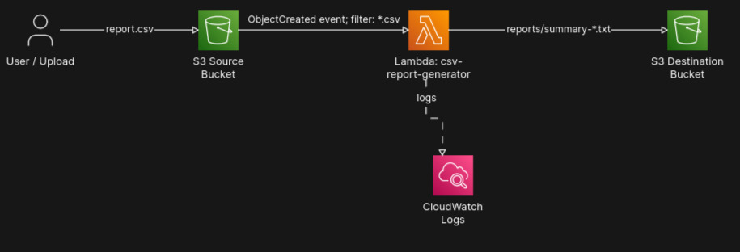
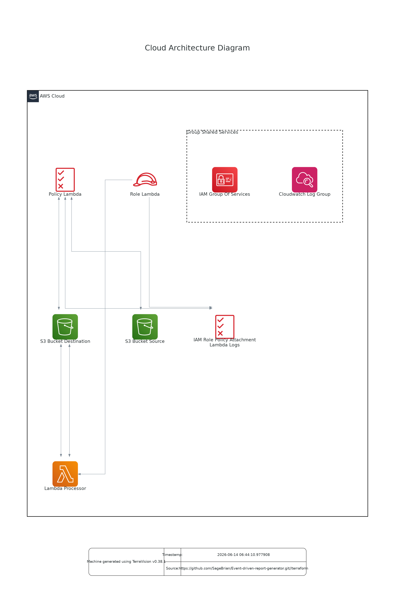

# Event-Driven CSV Report Generator

A serverless pipeline on AWS that turns a CSV upload into a processed report with no servers to manage and no manual steps. Drop a `.csv` into an S3 bucket, and a Lambda function parses it and writes a summary report to a second bucket. The entire stack is defined in Terraform and deploys with three commands.


---

---
## How it works



1. A file is uploaded to the **source bucket**.
2. S3 emits an `ObjectCreated` event. A suffix filter means only `.csv` files trigger the function.
3. The **Lambda function** reads the object, parses it with Python's `csv` module, and counts the records.
4. It writes a report to `reports/summary-<filename>.txt` in the **destination bucket**.

<details>
<summary>Auto-generated infrastructure diagram (TerraVision)</summary>



</details>

## Design decisions

| Decision | Why |
|---|---|
| **Serverless (S3 + Lambda)** | There is nothing to patch or scale, and cost is per-invocation. An idle pipeline costs close to nothing. |
| **Event-driven, not polling** | S3 pushes events to Lambda, so there is no scheduler or cron job and no idle compute waiting for files. |
| **Suffix filter on the S3 trigger** | Non-CSV uploads never invoke the function, which avoids wasted invocations. |
| **Separate source and destination buckets** | Writing output to the trigger bucket could cause recursive invocations. Two buckets rule that out. |
| **Scoped IAM policy** | The function can `GetObject` only on the source bucket and `PutObject` only on the destination bucket. Log permissions are limited to the three CloudWatch Logs actions it needs. |
| **Infrastructure as Code** | Every resource is in Terraform, so the environment is reproducible, reviewable, and easy to tear down. |
| **Randomized bucket names** | A `random_string` suffix avoids S3's global naming collisions so anyone can deploy the project without editing it. |

## Repository structure

```
.
├── src/
│   └── lambda_function.py      # Lambda handler: parse CSV, build report
├── terraform/
│   ├── main.tf                 # Buckets, IAM, Lambda, S3 trigger
│   ├── variables.tf            # Region (default: us-east-1)
│   ├── output.tf               # Bucket names
│   └── .terraform.lock.hcl     # Pinned provider versions
├── architecture-aws.dot.png    # Generated architecture diagram
└── README.md
```

## Getting started

### Prerequisites

- [Terraform](https://developer.hashicorp.com/terraform/install) `>= 1.0.0`
- [AWS CLI v2](https://docs.aws.amazon.com/cli/latest/userguide/getting-started-install.html), configured with credentials that can create S3, IAM, and Lambda resources

### Deploy

```bash
cd terraform
terraform init
terraform plan
terraform apply
```

Terraform prints the two generated bucket names when it finishes:

```
source_bucket_name      = "report-processor-source-x1y2z3"
destination_bucket_name = "report-processor-dest-x1y2z3"
```

To change the region, run `terraform apply -var="aws_region=eu-west-1"`.

### Try it

```bash
# 1. Create a sample file
cat > students.csv <<'EOF'
id,name,course,status
1,Alex Mercer,Cloud Architecture,Enrolled
2,Sarah Connor,Systems Networking,Graduated
EOF

# 2. Upload it to the source bucket
aws s3 cp students.csv s3://<source_bucket_name>/

# 3. Check the destination bucket (allow a few seconds)
aws s3 ls s3://<destination_bucket_name>/reports/

# 4. Read the report
aws s3 cp s3://<destination_bucket_name>/reports/summary-students.txt -
```

### Example output

```
=============================================
AUTOMATED CLOUD PROCESSING REPORT
=============================================
Original File: students.csv
Total Records Processed: 2
Status: SUCCESS

Raw Payload Summary:
[
  { "id": "1", "name": "Alex Mercer", "course": "Cloud Architecture", "status": "Enrolled" },
  { "id": "2", "name": "Sarah Connor", "course": "Systems Networking", "status": "Graduated" }
]
=============================================
```

### Debugging

Function logs go to CloudWatch under `/aws/lambda/csv-report-generator`:

```bash
aws logs tail /aws/lambda/csv-report-generator --follow
```

### Tear down

```bash
terraform destroy
```

Both buckets are created with `force_destroy = true`, so `destroy` removes them even if they still contain files.

## Known limitations

This is a working proof of concept, and some edge cases are not handled yet:

- **Only the first S3 record is processed.** A batched event with several records would skip the rest.
- **Object keys are not URL-decoded.** Files with spaces or special characters in their names may fail to load.
- **The whole file is read into memory.** This is fine for small files but will not scale to very large CSVs.
- **The report is a record count plus a JSON dump.** There is no real aggregation yet.
- **No error handling or retries beyond Lambda defaults.** A malformed file just fails the invocation.

## Roadmap

- [ ] Handle every record in the event and URL-decode object keys
- [ ] Add real analytics (column statistics, group-by summaries) using `pandas` or the standard library
- [ ] Add a dead-letter queue (SQS) for failed invocations
- [ ] Email report links to stakeholders with Amazon SES
- [ ] Output reports as PDF or HTML
- [ ] Add unit tests for the handler and a CI pipeline (`terraform validate`, `tflint`, `pytest`)
- [ ] Explicit CloudWatch log group with a retention period
- [ ] Remote Terraform state (S3 backend with locking)

## What this project demonstrates

- Designing an event-driven architecture on AWS
- Writing least-privilege IAM policies
- Managing infrastructure declaratively with Terraform, including provider version pinning
- Wiring S3 notifications, Lambda permissions, and IAM roles together correctly
- Building and testing a small data-processing function in Python

## License

Add a license of your choice (MIT is a common default for portfolio projects).